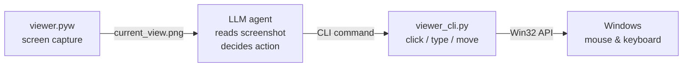

# AI Vision System

LLM-driven GUI automation for Windows. An AI agent sees your screen via continuous screenshots, locates UI elements, and interacts with them through mouse/keyboard commands.

> **Windows only** — uses Win32 API (ctypes) for screen capture and input. Will not run on Linux or macOS.

## The Problem

Vision LLMs can identify UI elements in screenshots but cannot reliably output precise pixel coordinates for clicking them. This project bridges that gap: it handles screen capture, element detection, coordinate calibration, and mouse/keyboard input so an LLM can operate a Windows desktop through a screenshot → read → click loop.

The included research paper (`LLMBasedDebugging.pdf`) explains why this is fundamentally hard — Vision Transformers process images as patch embeddings, not pixel grids, so they "capture nearby parts, yet fail to pinpoint the exact location."

## Quick Start

```bash
pip install -r requirements.txt

# Launch the GUI viewer (captures screenshots to llm_screenshots/current_view.png)
python viewer.pyw

# CLI: click at screen coordinates on monitor 1
python viewer_cli.py click --monitor 1 --x 500 --y 300

# CLI: find and click text on screen via OCR
python viewer_cli.py snap-text --query "Submit" --click

# Detect all GUI elements in a screenshot
python gui_locator.py --image llm_screenshots/current_view.png --save-overlay

# Run automated 9-target calibration (with calibration window open)
python auto_calibrate.py
```

Settings are created automatically on first launch at `configs/viewer_settings.json`. See `configs/viewer_settings.example.json` for defaults.

## How It Works



`viewer.pyw` and `viewer_cli.py` are independent tools. The viewer captures screenshots to a file. The CLI sends input events directly via Win32 API. The LLM orchestrates both.

## Architecture

```
viewer.pyw              # Main GUI — real-time screen viewer with click-through
viewer_cli.py           # CLI — capture, click, move, type, OCR, color search
gui_locator.py          # Element detector — buttons, inputs, dropdowns, checkboxes
auto_calibrate.py       # Automated calibration via scipy blob detection
core/capture/           # GDI screen capture backend
```

## DPI Scaling

Screenshots are physical pixels (1920x1080). Click commands are logical coordinates. The conversion depends on context:

| Scenario | Scale Factor |
|----------|-------------|
| Fullscreen capture at native resolution | 1.0 (pixels = click coords) |
| Viewer-downscaled screenshot | image_width / physical_width (e.g. ~1.316 at 125% DPI) |

Run the calibration tool (System Menu → Test Coordinate System) or `python auto_calibrate.py` to measure your system's factor.

## CLI Reference

Every command outputs JSON for parsing by LLM agents. Run `python viewer_cli.py <command> --help` for full details.

### Screen capture

```bash
python viewer_cli.py capture --out screenshot.png --cursor-type cross --cursor-size 15
```

### Mouse

```bash
python viewer_cli.py click --monitor 1 --x 500 --y 300                    # left click
python viewer_cli.py click --monitor 1 --x 500 --y 300 --button right     # right click
python viewer_cli.py click --monitor 1 --x 500 --y 300 --double           # double click
python viewer_cli.py click --monitor 1 --x 500 --y 300 --recap-out a.png  # click + recapture
python viewer_cli.py move  --monitor 1 --x 500 --y 300                    # move only
```

### OCR and text navigation

```bash
python viewer_cli.py ocr --img screenshot.png                     # extract all text
python viewer_cli.py snap-text --query "Submit" --click            # find text and click it
python viewer_cli.py snap-text --query "Subm" --fuzzy --monitor 1  # fuzzy match
```

### Color search

```bash
python viewer_cli.py snap-color-region --color "#0078D4" --monitor 1        # click region center
python viewer_cli.py snap-color --color "#0078D4" --nearest --tol 16        # nearest match
python viewer_cli.py list-color-regions --color "#0078D4" --tol 16          # list all regions
```

### Keyboard

```bash
python viewer_cli.py type --text "Hello World"                              # type text
python viewer_cli.py type --text "search query" --enter                     # type + Enter
python viewer_cli.py type --text "user@example.com" --query "Email:" --monitor 1  # OCR-navigate then type
```

## Dependencies

- Python 3.10+
- Windows (Win32 API via ctypes)
- Pillow, numpy, scipy, opencv-python (see `requirements.txt`)
- [Tesseract OCR](https://github.com/tesseract-ocr/tesseract) — required for `gui_locator.py`, `snap-text`, and `ocr` commands. Other commands work without it.

## License

[MIT](LICENSE)
